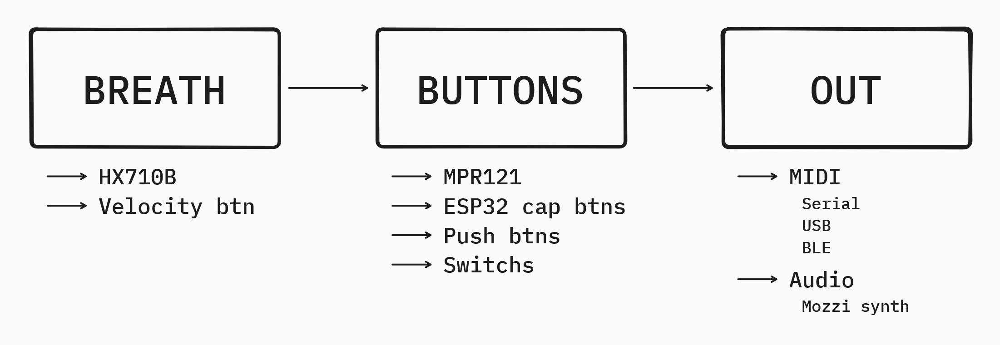

# The Diatonical Electric Wind Instrument project
By [Shawn Pinciara](https://www.instagram.com/shawnpinciara) and [Romeo Gabriele](https://linktr.ee/garaggio).

## Idea:
What if instead of having one hands position per note (on all the canonic wind instruments) you could enconde it more efficiently? _That's the reason why we built the DEWI_.

The notes of one scale can be encoded with 3 buttons (2^3 for the white keys) and 1 button more (to add all the sharps); now add another identical 4 buttons row (to keep your other hand entertained) and you can control with one hand the scale, and the other one the key/signature in wich the scale is played... a Diatonical EWI (aka DEWI).

Mapping the 4 buttons to the 12 notes has been a challenge but we found a good balance between beeing logical and organic:

## Project info:
Look at: https://shawnpinciara.github.io/dewi

## Make your own presets:
If you want to build your own DEWI and you don't have the same modules, you can make your own presets by chosing the BREATH type of sensor, the BUTTONS that you actually play, and what comes OUT from the instrument

Every one of this pieces have a file, anche each file has some functions to be implemented in order to get the instrument to play (soon or later additional information will be added).
After implementing the funcions needed, you can make a preset file where you #include the 3 libraries, and reference that preset file in the DEWI.INO main file.
Presets can be found in the folder presets/ .

